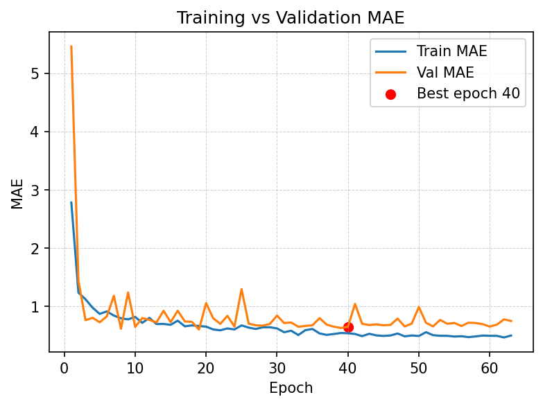
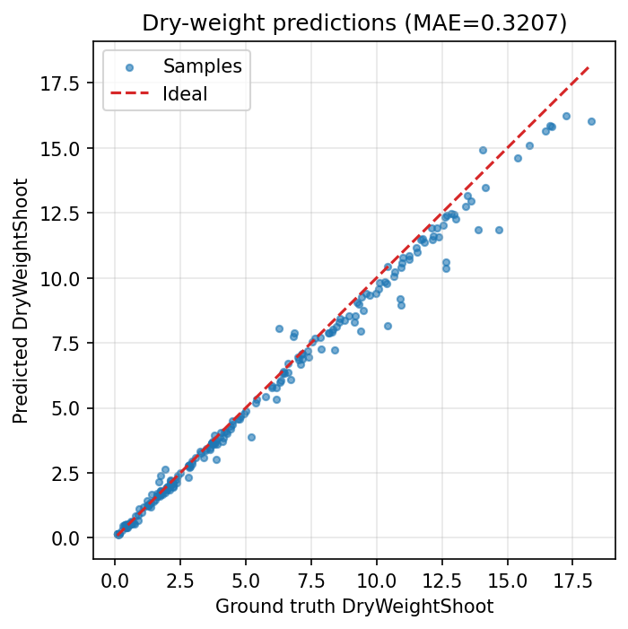
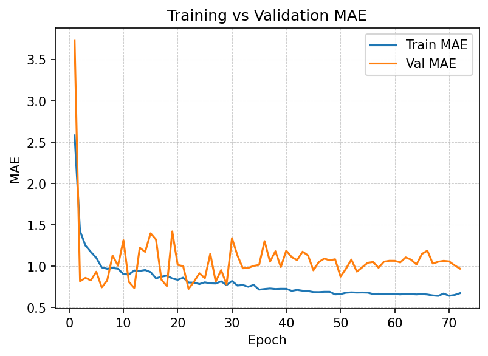
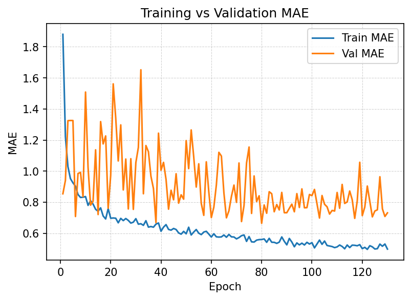
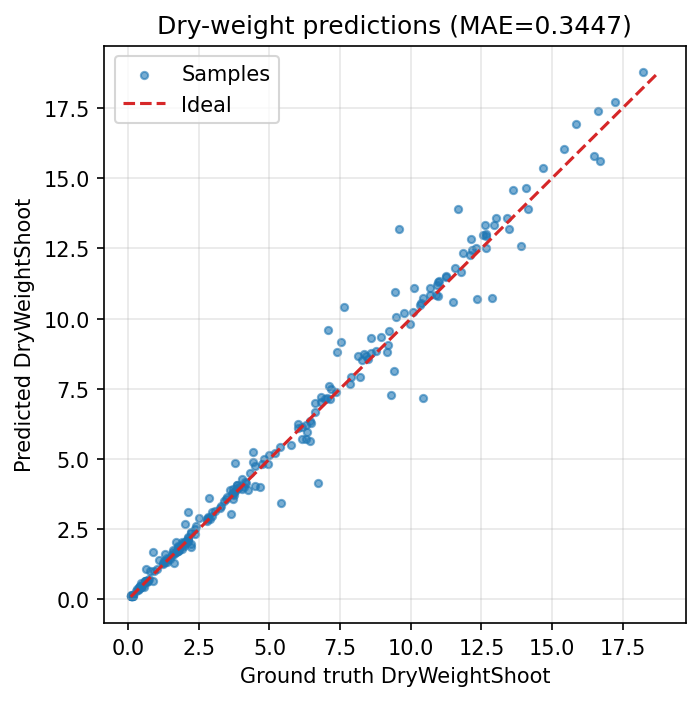
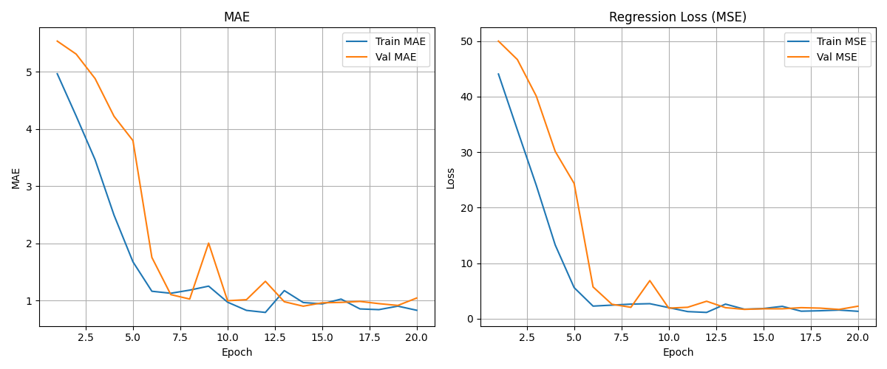
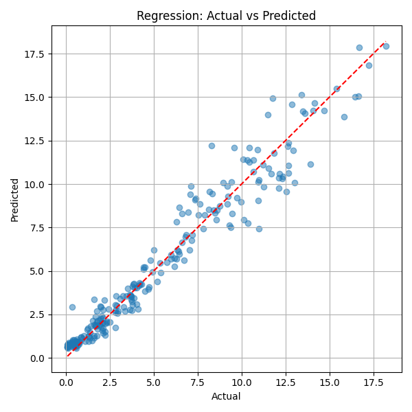

# NeuralSprouts

NeuralSprouts contains multiple deep-learning pipelines for predicting lettuce dry weight from RGB and depth imagery.

## Repository Structure

```
NeuralSprouts/
├── datasets/                 # Training, test, and final sets (RGB + Depth)
├── models/                   # Independent model implementations
│   ├── simple_cnn/
│   ├── model_v1/
│   ├── model_v2/
│   ├── model_v3/
│   ├── model_v4/
│   ├── model_v4.1/
│   ├── model_v4.2/
│   ├── model_v4.3/
│   ├── model_v6/
│   ├── model_v8/
│   └── multimodal_fusion/
├── requirements.txt
└── README.md
```

## Getting Started

1. Place dataset files in `datasets/` (see [datasets/README.md](datasets/README.md)).
2. Install dependencies:

   ```bash
   pip install -r requirements.txt
   ```

3. Choose a model folder in `models/` and follow its README.

## Model READMEs

- [simple_cnn](models/simple_cnn/README.md) - Lightweight baseline regressor.
- [model_v1](models/model_v1/README.md) - Multi-branch CNN (RGBD regression + RGB classification).
- [model_v2](models/model_v2/README.md) - Three-branch extension with additional leaf-area target.
- [model_v3](models/model_v3/README.md) - ResNet18 transfer-learning regression pipeline.
- [model_v4](models/model_v4/README.md) - Fusion network with staged branch training.
- [model_v4.1](models/model_v4.1/README.md) - Simplified single-branch RGB regressor (MAE-focused).
- [model_v4.2](models/model_v4.2/README.md) - MAE-focused RGB + RGBD dual-branch fusion model.
- [model_v4.3](models/model_v4.3/README.md) - Iteration of v4.2 with updated training/evaluation artifacts.
- [model_v8](models/model_v8/README.md) - Refined production-oriented training/evaluation pipeline.
- [multimodal_fusion](models/multimodal_fusion/README.md) - Advanced multimodal architecture with richer feature fusion.

Note: `models/model_v6/` is available as an experimental implementation but currently does not include a dedicated README.

## Some Available Charts for visualizations

The repository already includes training and evaluation plots from several model runs.

### model_v8

Training curves:



Evaluation scatter/fit:




### model_v4.3

Training curves:



### model_v4.2

Training curves:



Evaluation scatter/fit:



### model_v3

Model summary:



Actual vs predicted:




## Notes

- Most model folders are self-contained (data loading, training, evaluation, prediction).- Primary comparison metric across newer variants is MAE for dry-weight regression.
- For reproducibility and model-specific arguments, always use the commands documented in each model README.
